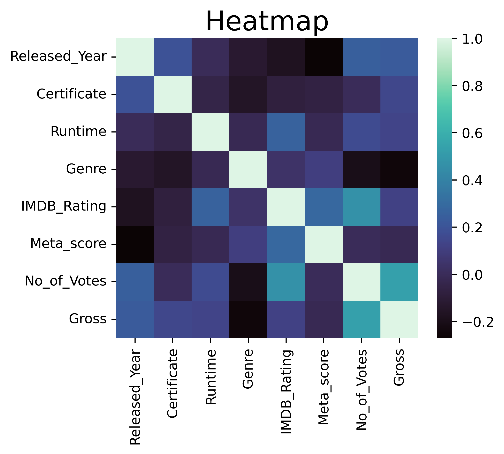
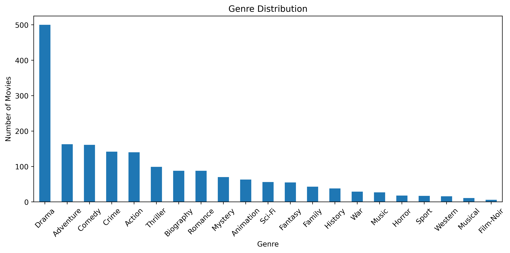
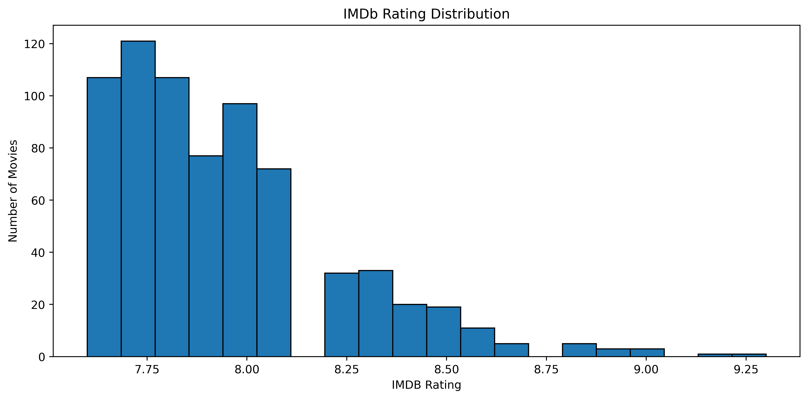
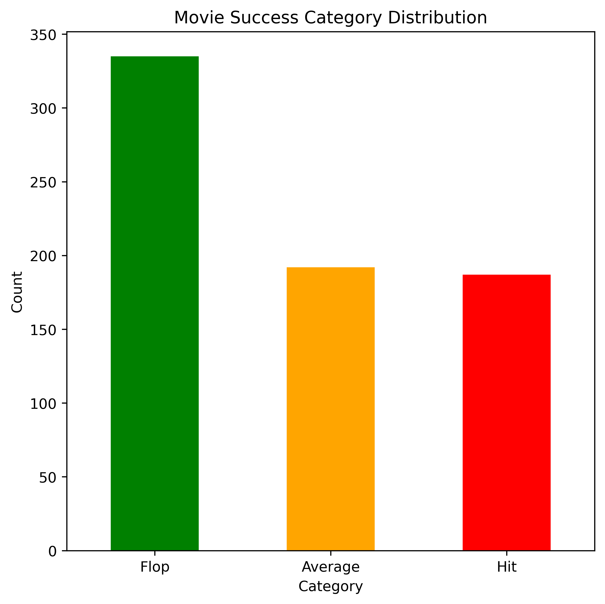

# Movie Success Predictor

A Machine Learning project that predicts whether a movie is likely to become a **Hit**, **Average**, or **Flop** based on its characteristics.

The project uses a **Decision Tree Classifier** trained on movie metadata and includes data analysis visualizations created using Matplotlib and Seaborn.

---

## Project Overview

The model predicts movie success categories:

* Hit
* Average
* Flop

using features such as:

* Released Year
* Certificate Rating
* Runtime
* Genre
* IMDb Rating
* Meta Score
* Number of Votes

---

## Machine Learning Model

**Algorithm:** Decision Tree Classifier

**Library:** Scikit-learn

### Data Preprocessing

* Missing value handling
* One-Hot Encoding using `pd.get_dummies()`
* Feature alignment using saved training columns

### Model Evaluation

* Accuracy Score
* Classification Report
* Train/Test Split

### Final Performance

* Training Accuracy: **75.77%**
* Testing Accuracy: **66.41%**

---

## Data Visualizations

The project includes exploratory data analysis using Matplotlib and Seaborn.

### Correlation Heatmap

Shows relationships between numerical movie features.



### Genre Distribution

Analyzes the frequency of different movie genres.



### IMDb Rating Distribution

Visualizes the spread of IMDb ratings across movies.



### Movie Success Category Distribution

Displays the balance between Hit, Average, and Flop movies.



### Additional Visualizations

Any custom charts created during analysis can be stored in the `images/` folder and embedded directly into the README.

---

## Project Structure

```text
movie-success-predictor/
│
├── movies.csv
├── movie-model-training.py
├── predictor.py
│
├── movie-success-predictor.joblib
├── columns.joblib
│
├── images/
│   ├── heatmap.png
│   ├── genre-distribution.png
│   ├── imdb-ratings.png
│   └── success-distribution.png
│
└── README.md
```

## How to Run

### Install Dependencies

```bash
pip install pandas numpy scikit-learn matplotlib seaborn joblib
```

### Train the Model

```bash
python train_model.py
```

### Run Predictions

```bash
python predictor.py
```

---

## Example Prediction

```text
Released Year: 2003
Certificate: PG
Runtime: 132
Genre: Action
IMDB Rating: 9.0
Meta_score: 90
No_of_Votes: 23472739

Predicted Movie Success: Hit
```


---

## Technologies Used

* Python
* Pandas
* NumPy
* Scikit-learn
* Matplotlib
* Seaborn
* Joblib

---

## Key Insights

* Movies with higher IMDb ratings are more likely to be classified as Hits.
* Meta Score contributes significantly to prediction performance.
* Number of Votes has a noticeable impact on movie success prediction.
* Genre and certificate ratings also influence classification.

---

## Future Improvements

* Random Forest Classifier
* XGBoost Implementation
* Hyperparameter Tuning
* Streamlit Web Application
* Feature Importance Visualization
* Movie Recommendation System Integration

---

## Author

[kanushri20]

This project was created to learn:

* Data Cleaning
* Feature Engineering
* Machine Learning Pipelines
* Model Serialization with Joblib
* Data Visualization
* GitHub Project Deployment
